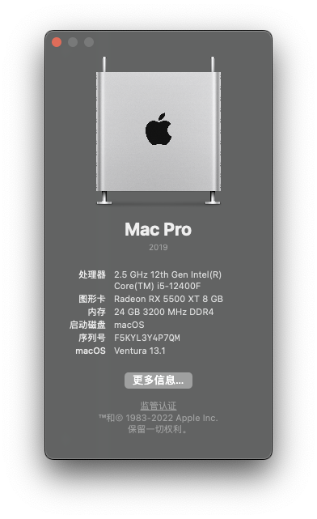
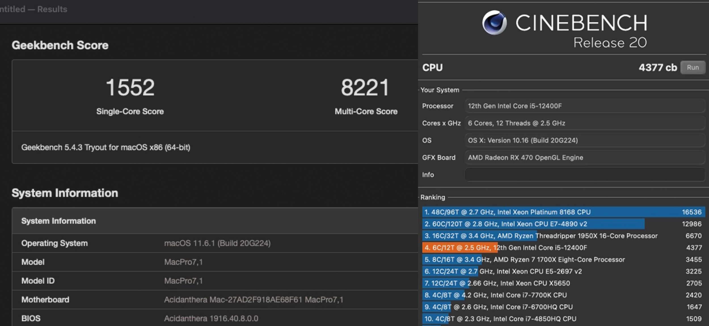
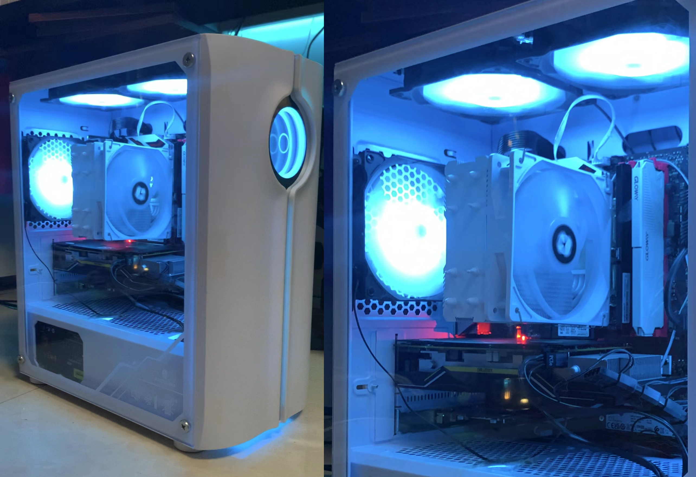

# MAXSUN-B660M-TERMINATOR Hackintosh OpenCore EFI

### [简体中文](README.zh_CN.md)

### OpenCore

[OpenCore 0.8.9](https://github.com/acidanthera/OpenCorePkg)

### OS Version Tested

- macOS Monterey 12.x
- macOS Ventura  13.x 

### Hardware 1

- Motherboard: MAXSUN-B660M-TERMINATOR
- Bios Version: H4.2G（2022-11-26）
- CPU: Intel i5-12400F
- RAM: KINGBANK 16G DDR4 3200MHz + GLOWAY 8G DDR4 3200MHz
- SSD: 1. Kingston NV2 1TB PCIe 4.0 MacOS
- SSD: 2. PM981a 256G Pcie 3.0 Windows
- HDD: Western Digital 1TB
- GPU: JIESHUO RX5500XT 8G
- Audio: Realtek ALC897
- Ethernet: Realtek 8125 PCle 2.5GbE Family Controller
- Wireless: Fenvi FV-T919 (BCM94360CD)
- CPU Cooling：Thermalright AX12R SE ARGB Wihte
- Display: KTCH27S12 2K 170hz
- PSU: Great Wall Gold Dragon 500W
- CASE: WJCOOLMAN MATX White
- FAN：EVESKY COOL BLUE 1225 * 7 

### Hardware 2
- Motherboard: MAXSUN-B660M-TERMINATOR
- Bios Version: H4.2G（2022-11-26）
- CPU: Intel i5-12400F
- RAM: PREDATOR 16G*2 DDR4 3600MHz
- SSD: Western Digital SN750 500G PCIe 3.0 MacOS
- GPU: YESTON RX6800 16G
- Audio: Realtek ALC897
- Ethernet: Realtek 8125 PCle 2.5GbE Family Controller
- Wireless: BCM94360CS2
- CPU Cooling：ID-COOLING FROSTFLOW X 360
- Display: KUYCON 5K
- PSU: PHANTEKS AMP 1000W
- CASE: ASUS AP201 + 1 CASE FAN

### Bios Setup

| Name | Option |
| ----- | --- |

### Notes

 - Use [OpenCore Configurator](https://mackie100projects.altervista.org/opencore-configurator/) build your own SMBIOS
 
 
### ScreenShot 

- About This Mac（Hardware 1）

- Geekbench5 & Cinebehch R20 Score i5-12400F 

- WJCOOLMAN MATX White（Hardware 1）

